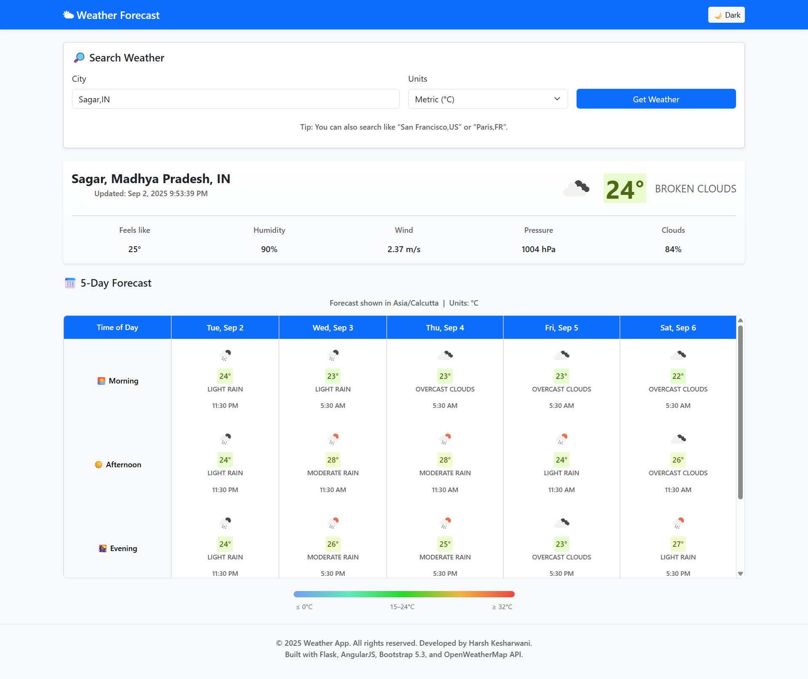

# 🌤 Weather Forecast WebApp

Built with Flask, AngularJS, Bootstrap, and the OpenWeatherMap API. Displays current conditions and a 5‑day forecast in a responsive UI.

## 🚀 Overview

This project demonstrates full‑stack integration of a Flask backend with an AngularJS frontend, styled using Bootstrap 5.3. It fetches real‑time weather data from the OpenWeatherMap API and renders a current snapshot plus a 5‑day forecast.

## 📸 Screenshot



## 📂 Project Structure

```bash
weather-app/
├─ app.py                  # Flask backend
├─ requirements.txt        # Python dependencies
├─ templates/
│  └─ index.html           # AngularJS + Bootstrap UI
├─ static/
│  ├─ app.js               # AngularJS app (frontend logic)
│  ├─ styles.css           # Custom styles
│  └─ screenshot.png       # Example screenshot
└─ README.md               # Documentation
```

## 🖥️ Backend (Flask)

- Endpoint: GET /api/weather?q=&lt;city&gt;&amp;units=&lt;units&gt;
- Calls OpenWeatherMap API and returns:
  - Current weather
  - Forecast list (3‑hour intervals)
  - Location metadata
- Uses environment variable OPENWEATHER_API_KEY (supports .env)

Example:

```bash
    /api/weather?q=London&units=metric
```

## 🎨 Frontend (AngularJS + Bootstrap)

- Search by city; select units (metric, imperial, standard)
- Current weather card: temperature, icon, description, humidity, wind, clouds
- Forecast table:
  - Columns = days (local to searched city)
  - Rows = 3‑hour time slots
  - Heatmap‑style temperature cells with icons/descriptions
- Legend bar for temperatures
- Responsive and scrollable on mobile

## 🔧 Tech Stack

- Backend: Python 3.12, Flask
- Frontend: AngularJS 1.8.x, Bootstrap 5.3
- API: OpenWeatherMap

## ⚙️ Setup

```bash
# Clone
git clone <your-repo-url>
cd weather-app

# Create venv & install deps
python -m venv venv
# Linux/Mac
source venv/bin/activate
# Windows (PowerShell)
# .\venv\Scripts\Activate.ps1
pip install -r requirements.txt

# Configure API key (create .env in project root)
echo "OPENWEATHER_API_KEY=your_api_key" > .env
# Windows (PowerShell):
# Set-Content .env "OPENWEATHER_API_KEY=your_api_key"

# Run (dev)
flask --app app.py run --debug
```

Open [http://127.0.0.1:5000](http://127.0.0.1:5000) in the browser.

## 📝 Notes

- Timezone handling uses the city.timezone offset from the API
- Heatmap colors map colder→warmer temps (blue→green→red)

## ✅ Learning Highlights

- Flask API creation and environment configuration
- AngularJS $http usage and interpolation tweaks
- Bootstrap responsive layout and sticky headers
- Timezone and interval‑based forecast rendering

## 📄 License

[MIT](Licence).

